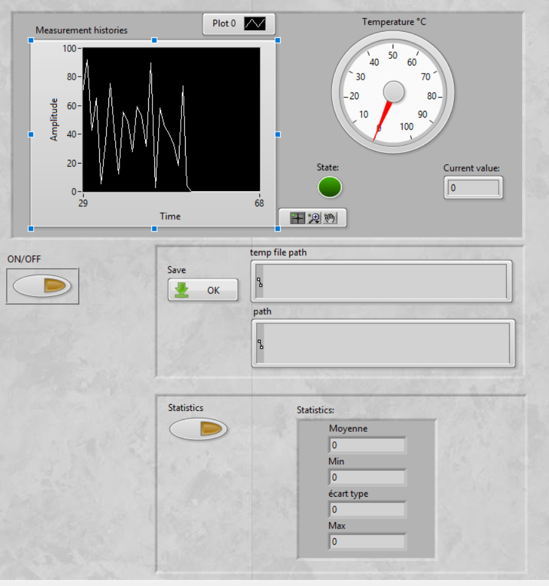
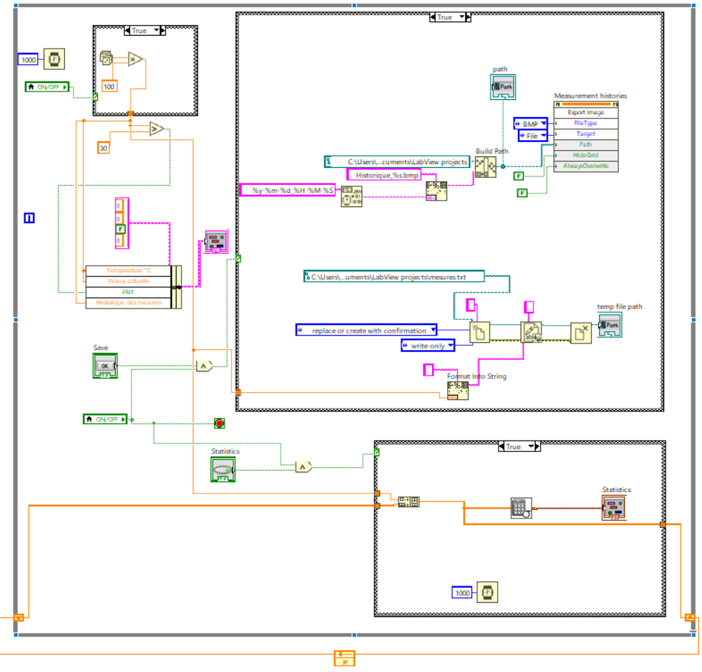

# HMI_Temperature_Analyzer

Interface Homme-Machine (IHM) réalisée sous **LabVIEW** pour surveiller, afficher et analyser les températures enregistrées en temps réel.

---

## 🔧 Fonctionnalités principales

- 🖥️ **Affichage graphique** des mesures en temps réel (graphe amplitude vs temps)
- 🌡️ **Affichage de la température instantanée** (thermomètre analogique + valeur numérique)
- 📁 **Sauvegarde automatique** de l’historique des mesures au format `.txt`
- 📸 **Export de captures d’écran** au format image `.bmp`
- 📊 **Calcul automatique de statistiques** :
  - Moyenne
  - Minimum
  - Maximum
  - Écart-type
- 🔘 Boutons de contrôle :
  - ON/OFF général
  - Enregistrement
  - Calcul des statistiques

---

## 🗂️ Structure du projet

- `Main.vi` : Interface utilisateur et logique principale
- `AnalyseStatistiqueTemp.vi` : Sous-VI pour calcul des statistiques
- `Data/` : Contient les fichiers de mesures exportés (`measures.txt`)
- `Images/` : Contient les captures d’écran des graphes (`Historique_...bmp`)

---

## 🧰 Outils utilisés

- LabVIEW
- Structures : Boucles, Séquences, Conditions
- Composants : Graphique, Gauge, Clusters, File I/O

---

## 📸 Aperçu du block diagram

---

## 📜 Licence

Ce projet est sous licence MIT – Voir le fichier `LICENSE` pour plus d’informations.

---

## 🧑‍💻 Auteur

- **[KhmaiesF]**
- Étudiant en Génie Électronique, ENET'Com
